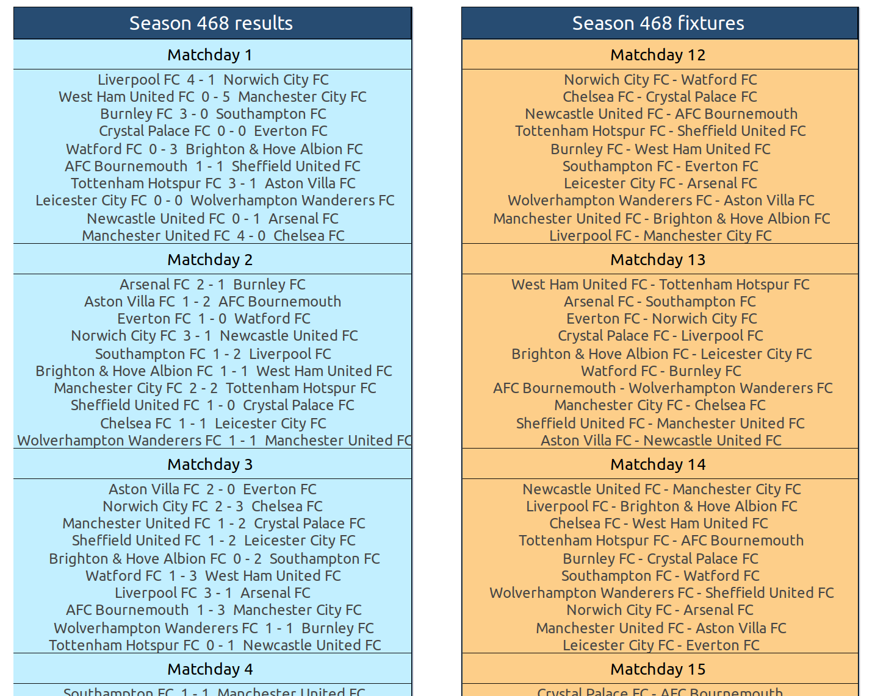
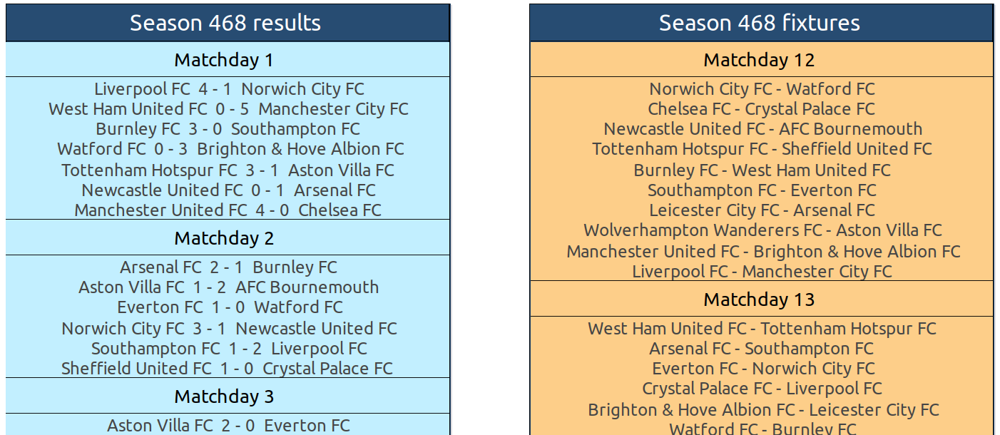
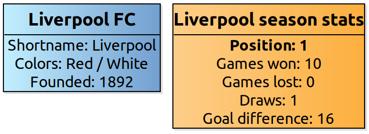
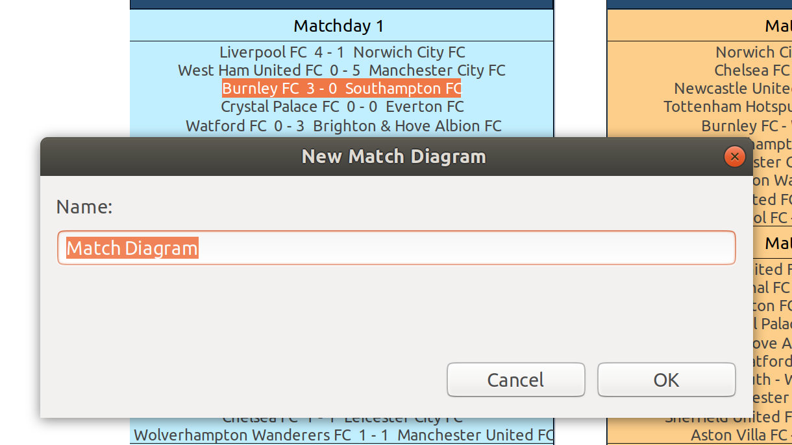
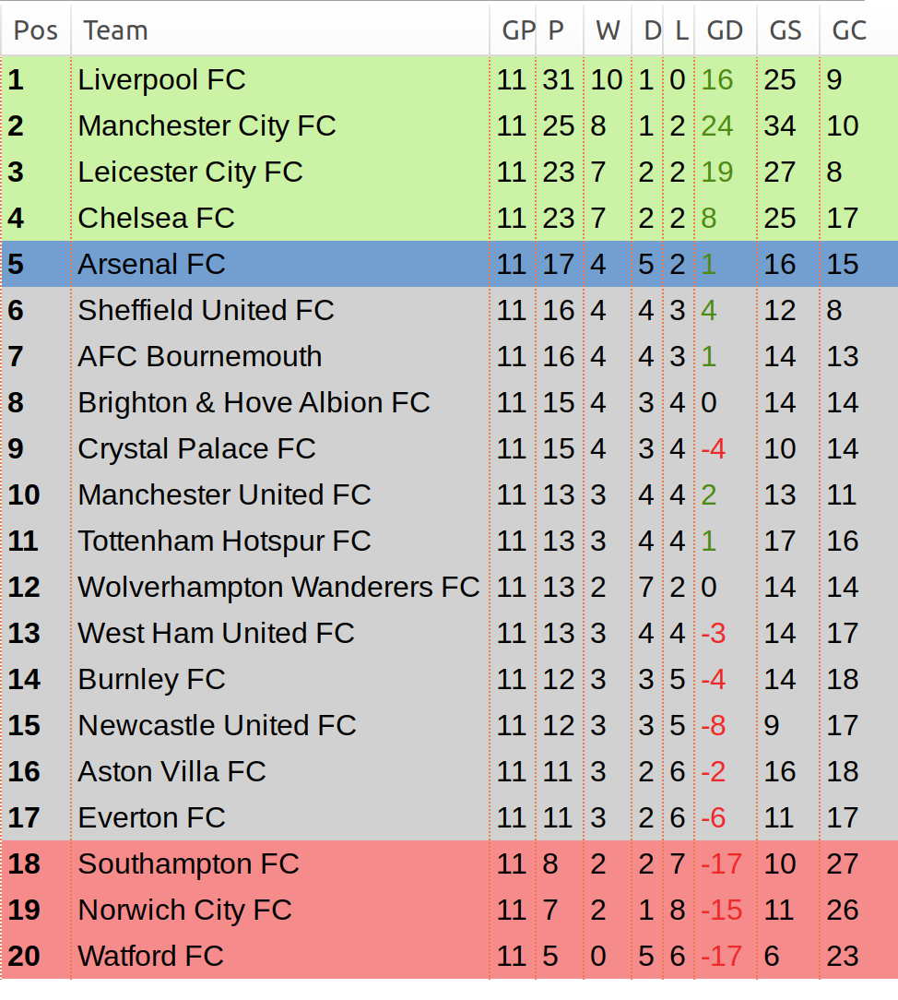
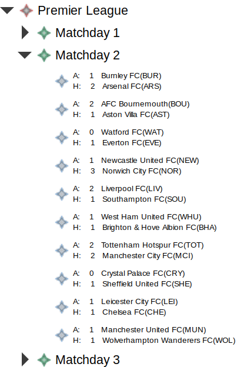

# Football result - Advanced Software Engineering (TDT4250) semester project

_Members: Mats Tyldum, Henrik Finnerud Larsen, Mats Davidsen and Siri Mykland_

## Description

This projects aim to visualize information from different football competions. The project uses the API provided by [football-data.org](https://www.football-data.org/) to gather data on different football competitions. The data is transformed and mapped to an Ecore model and
visualized using Sirius in Eclipse (2019-09).
TODO: Skrive om hvordan alle ligaer kan brukes

## Requirements

- Ecore and Eclipse Modelling Framework (EMF) for modelling
- Sirius for visualizing
- Jackson library for mapping JSON

## Set up dev environment

_Note: Sirius and Ecore/EMF need to be installed in advance_

- Clone repo `git clone https://github.com/matseda/TDT4250.Project.git`
- Install Jackson, if you don't have it installed already:
  - Navigate to "Install new software" in Eclipse
  - Click "Add..." to add Orbit repository
  - Insert "http://download.eclipse.org/tools/orbit/downloads/drops/R20170919201930/repository" in location
  - Click "Add"
  - Choose "All Bundles" and check "Jackson-annotations", "Jackson-core" and "jackson-databind"
  - Click "Next" and then "Finish"

### Updating data

The repository includes data files (JSON format) used in the representation. If you want to, new data can be fetched from the API. The JSON files and Ecore models will then reflect the new updates:

- Navigate to "TDT4250.project.resource/src/fetch"
- Run "Main.java" as "Java Application"

### Open and edit view

Opening the view, with the possibilty for editing can be done like this.

- Click run as Eclipse application.
- Import these projects to the new workspace: "TDT4250.project.design", "TDT4250.project.model" and "TDT4250.project.samples".
- Views:
  - Open the "representations.aird" file in the "TDT4250.project.samples" project.
  - Select the view ypu want to open in the "Representations" tab.
  - TODO: Describe the more on each view when finished.
- Editing:
  - Open the "project.odesign" file in the "TDT4250.project.design/description" folder.
  - TODO: Describe the more on each view when finished.

## Model
TODO: Describe model

## Viewpoints
This project includes different viewpoints to visualize data. Description and images of these views will be presented below.

### Diagrams
One of the main features of the Sirius framework is the ability to create diagrams. Three diagrams: Season, match and team have been developed. Each including different features from the diagram tool.

- Season: This diagram visualizes all the matchdays in a season split into two categories, completed matches(results) and future matches (fixtures). These categories are represented using two layers, making it possible to view only result, fixtures or both depending on what you want. In addition to this, a filter functions has also been added. Two filters "Liverpool matches" and "No draws" makes it possible to hide all matches which not correspond to these facts. The filters can be applied individually or together as illustrated in the figures below.
  - All matches 
  - Liverpool matches 
  - Matches with no draws 
- Match: The match diagram lists information of each match.
  
- Team: The team diagram lists all information about a team together with season stats. The season stats are calculated using OCL expressions.
  

### Navigation between diagrams
It is possible to navigate between diagrams and create new ones if they don't exist by double-clicking on different nodes. Navigation is possible:
- From season to match diagram. Double click on a match to view the corresponding match diagram.
- From match to team diagram. Double click "view home team" or "view away team" to navigate to the corresponding teams diagram
If a diagram already exist you will end up in that view. If not a popup will prompt you to create a new one.

### Table
The Season table is an Edition Table representing the Standings of the current season, where each line represent a position in the standings and each column represents a property of that position. The table uses features such as:
- Property views for position: Pointing to the Position property view.
- Conditional styles for Premier League using OCL:
    - Visualize teams qualified for Champions League (top 4) with a green background. 
    - Visualize teams qualified for Europa League (position 5) with a blue background.
    - Visualize teams that are beein relegated (bottom 3) with a red background.
    - Different color for positive and negative goal difference: Red for negative and green for positive.

### Tree
The Tree View representation provides a hierarchical viewpoint of the Football Season. Each node in the tree represents an element, with Season being the root node. 
- Season
  - Matchdays
    - Match details

## Property Views 
The Property View of for position show a position as three pages.
- Info
- Matches
- Goals

